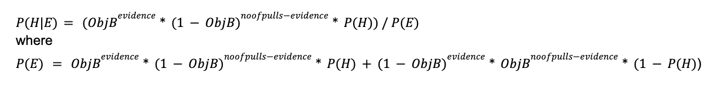
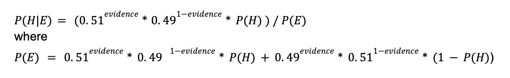

# wu-epistemic-advantage
A model of the epistemic advantage at the margins

## Questions

## Updating Posterior Belief

Wus seems to update the posterior probability using the following value calculated for P(E)


The following are the parameters defined:

* **ObjB = 0.51**, which describes the actual probability that B will return a successful result. This is also uses this where the agent gathers evidence in the line `evidence_givenB[n] = int(np.random.binomial(noofpulls, objectiveB, size=None))`

* **noofpulls = 1**, which seems to define how many times an agent runs an experiment, hence the naming of number of bandit arm pulls. This is also used in the line to gather evidence `evidence_givenB[n] = int(np.random.binomial(noofpulls, objectiveB, size=None))`

Inputting these parameters into the formula, it can be simplified into


**My biggest questions is the following:**

1. Why is the ObjB parameter included in updating the agent's belief? Wouldn't the actual probability of the occurance of B be unknown to the agent, as it is something that they are attempting to figure out by updating their posterior?


These formulas are are drawn from the lines of code here:
```py
P_i_E[a][n] = ((objectiveB ** evidence_givenB[n]) * ((1 - objectiveB) ** (noofpulls - evidence_givenB[n])) * B_posterior_probability[a]) + (((1 - objectiveB) ** evidence_givenB[n]) * (objectiveB ** (noofpulls - evidence_givenB[n])) * (1 - B_posterior_probability[a]))
```

### Multiple Pulls
If the agent is pulling the bandit arm multiple times, will this just return one number? 
`evidence_givenB[n] = int(np.random.binomial(noofpulls, objectiveB, size=None))`

### Agent Choice - Updating Beliefs
This is Wu's code for updating beliefs after the new evidence is calculated
```py
P_i_E = [[0 for _ in G.nodes()] for _ in G.nodes()]

lst_2 = list(G.nodes())
lst = list(G.nodes())
random.shuffle(lst_2)
random.shuffle(lst)

for a in lst_2:
    for n in lst:
        if B_probability[n] > 0.5:
            if ((a >= (len(lst) / d)) and (n >= (len(lst) / d))) or (a < (len(lst) / d)):
                P_i_E[a][n] = ((objectiveB ** evidence_givenB[n]) * ((1 - objectiveB) ** (noofpulls - evidence_givenB[n])) * B_posterior_probability[a]) + (((1 - objectiveB) ** evidence_givenB[n]) * (objectiveB ** (noofpulls - evidence_givenB[n])) * (1 - B_posterior_probability[a]))
                B_posterior_probability[a] = ((objectiveB ** evidence_givenB[n]) * ((1 - objectiveB) ** (noofpulls - evidence_givenB[n])) * B_posterior_probability[a]) / P_i_E[a][n]
    
```
Question 1: what is this P_i_E list calculating/representing? Is it just part of the calculation updating the posterior belief?

Question 2: How is she checking if a node is a neighbor? Is this the second nested if statement?

Question 3: General - does it matter the order in which you update a bayesian agent's beliefs? Does the order matter in determining the outcome?

Question 4: Why is she shuffling the order of the lists? Is this because the order of updating beliefs does matter, so she tries to randomize this variability?

**My Translation of code**

I changed this code to the following:
```py
# define function to calculate posterior belief
def calculate_posterior(prior_belief: float, evidence: float) -> float:
    # Calculate likelihood
    pEH_likelihood = success_rate
    
    # Calculate normalization constant
    pE_evidence = (pEH_likelihood * prior_belief) + (1 - pEH_likelihood) * (1 - prior_belief)

    # Calculate posterior belief using Bayes' theorem
    posterior = (pEH_likelihood * prior_belief) / pE_evidence
    
    return posterior

# update the beliefs, based on evidence and neighbors
for node, node_data in graph.nodes(data=True):
    neighbors = graph.neighbors(node)
    # update belief of "b" on own evidence gathered
    if node_data['b_evidence'] is not None:
        node_data['b_success_rate'] = calculate_posterior(node_data['b_success_rate'], node_data['b_evidence'])
    
    # update node belief of "b" based on evidence gathered by neighbors
    for neighbor_node in neighbors:
        neighbor_evidence = graph.nodes[neighbor_node]['b_evidence']
        if neighbor_evidence is not None:
            node_data['b_success_rate'] = calculate_posterior(node_data['b_success_rate'], neighbor_evidence)

return graph
```

### Break Condition Metrics
In the break condition for all win (or community convergence to true belief), what are the win_turn and community_win_turn metrics supposed to track? Same question in the polarized break condition.
```py
for n in G.nodes():
    win_turn[1][n] += win_turn[0][n]
    win_turn[0][n] = 0

community_win_turn += t
break
```

### Metrics
In the AgentChoice function, why is she keeping track of the `average_payoff` and `average_cumulative payoff`? Is this just to display for visualizations?


* Seems to update just on the evidence of the neighbors, this is unchanging.
If the agent choose bandit arm A, can they still listen to their neighbors and update their beliefs?

## Thoughts
* Could extend the model, she currently updates on evidence, could update on beliefs of other agents
    * If all at once, how do I stop it from not updating from partial beliefs? For instance, these beliefs may be recursively based on one another in the surrounding network.
* Additionally, with high trust in "domain expert" could take the stated belief as fact (the agent updates their own belief fully to match). This would converge on the ideas very quickly.